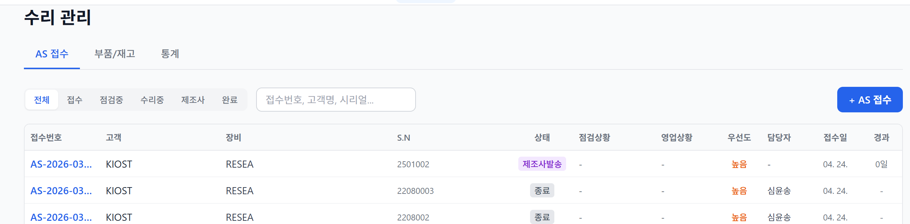
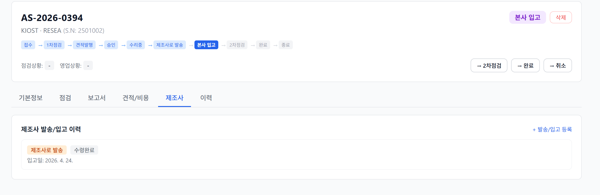
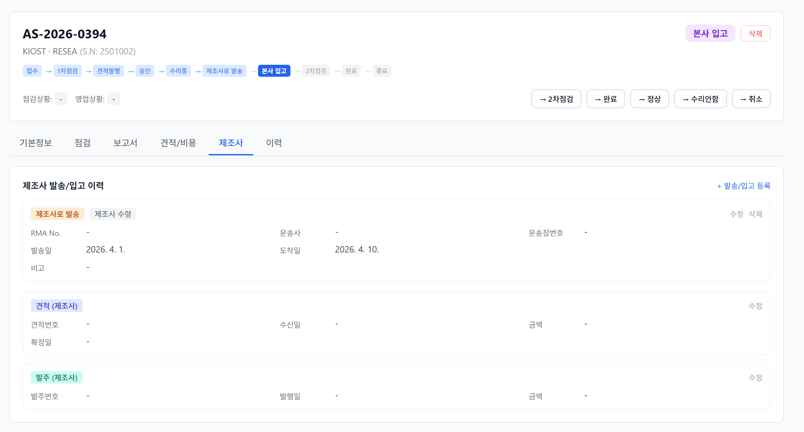
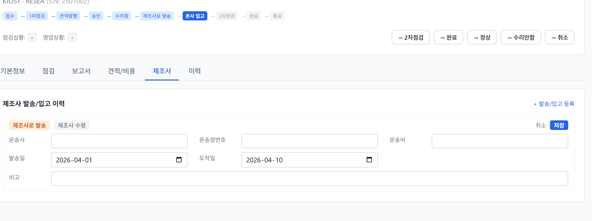
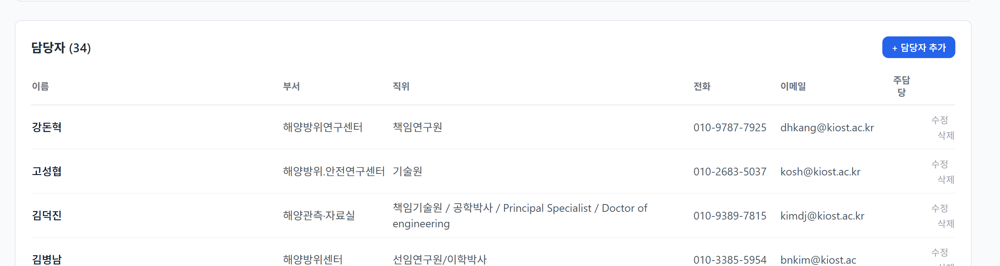

# 📘 AS(수리) 관리 사용자 매뉴얼

- **버전**: v1.2 (목록 정렬 / 취소 복구 / 사전 등록 안내 추가)
- **작성일**: 2026-04-24
- **대상 사용자**: OPERATOR · MANAGER · ADMIN 전원

---

## 📑 목차

1. [개요](#1-개요)
2. [메뉴 구조](#2-메뉴-구조)
3. [업무 전체 흐름(FSM)](#3-업무-전체-흐름-fsm)
4. [AS 접수 등록](#4-as-접수-등록)
5. [1차 점검](#5-1차-점검)
6. [본사 수리 경로](#6-본사-수리-경로)
7. [제조사 발송 경로](#7-제조사-발송-경로)
8. [2차 점검](#8-2차-점검)
9. [완료 · 종료 처리](#9-완료--종료-처리)
10. [정상 · 수리안함 처리](#10-정상--수리안함-처리)
11. [취소 · 삭제 · 복구](#11-취소--삭제)
12. [권한 · 계정 역할](#12-권한--계정-역할)
13. [자주 묻는 사용법](#13-자주-묻는-사용법)

---

## 1. 개요

AS(수리) 관리는 고객사에서 입고된 장비의 **점검 → 수리 → 반납** 전 과정을 ERP에서 추적하는 업무입니다.

### 1.1 핵심 개념

| 용어 | 의미 |
|---|---|
| 🔢 **AS 접수번호** | `AS-YYYY-NNNN` 형식. 예: `AS-2026-0001` |
| 📊 **상태(Status)** | 현재 AS가 어느 업무 단계에 있는지 (총 13종, 아래 FSM 참조) |
| ⚖️ **판단(Decision)** | 1차/2차 점검 결과. **본사수리 · 제조사발송 · 정상 · 수리안함** 4가지 |
| 📦 **Shipment** | 제조사 발송·본사 입고 이력. 한 AS에 여러 건 가능 |
| 🏷️ **RMA No.** | Return Merchandise Authorization 번호 (제조사 반품 승인) |

### 1.2 이관 데이터 식별

| 접두사 | 의미 |
|:-:|---|
| `AS-` | ERP 네이티브 접수 |
| `SA-` | 2026-04-24 엑셀 수리현황 이관 건 (20건) |

---

## 2. 메뉴 구조

### 2.1 상위 메뉴



**수리 관리** 메뉴 (`/repair`) 아래 5개 탭:

| 탭 | 용도 |
|---|---|
| **AS 접수** | AS 건 목록 · 신규 접수 |
| **부품/재고** | 수리용 부품 마스터 · 입출고 |
| **고객사** | 고객 정보 (구매/회계 탭과 공유) |
| **제조사/공급사** | 제조사 정보 (구매/회계 탭과 공유) |
| **통계** | AS 현황 대시보드 |

### 2.2 AS 접수 목록 화면

```
┌───────────────────────────────────────────────────────────────────────┐
│ [전체][접수][점검중][본사수리중][제조사수리중][본사입고][완료]         │
│ 🔍 접수번호/고객명/시리얼 검색...                   [+ AS 접수 등록]   │
├───────────────────────────────────────────────────────────────────────┤
│ 접수번호    고객     장비     S.N     상태    우선도 접수일             │
│ AS-2026-03  KIOST  RESEA  2501002  제조사로 발송  높음 ...              │
│ ...                                                                   │
└───────────────────────────────────────────────────────────────────────┘
```

- **상단 필터**: 상태 그룹별 필터링
- **검색 박스**: 3가지 필드 통합 검색
- **+ AS 접수**: 신규 접수 등록 폼 열기
- **컬럼 정렬** (v1.2): 컬럼 헤더 클릭 시 정렬
  - 첫 진입 시 **접수일 ▼** (최신순) 기본 표시
  - 헤더 클릭 → ▲ (오름차순) → 다시 클릭 → ▼ (내림차순) 토글
  - 정렬 가능 컬럼: 접수번호 · 고객 · 장비 · S.N · 상태 · 점검상황 · 영업상황 · 우선도 · 담당자 · 접수일

### 필터 그룹 분류

| 필터 | 포함 상태 |
|---|---|
| 전체 | 모든 건 |
| 접수 | `RECEIVED` |
| 점검중 | `INSPECTING_1ST`, `INSPECTING_2ND` |
| 본사수리중 | `QUOTED`, `APPROVED`, `REPAIRING` |
| 제조사수리중 | `SHIPPED_TO_MFG` (제조사에 발송돼 아직 돌아오지 않음) |
| **본사입고** | `RECEIVED_FROM_MFG` (제조사에서 돌아와 2차점검·완료 대기) |
| 완료 | `COMPLETED`, `NO_FAULT`, `NO_REPAIR`, `CLOSED` |

### 2.3 AS 상세 화면 (헤더 구조)



```
┌─────────────────────────────────────────────────────────────┐
│ AS-2026-0394    [본사 입고]  [삭제]                         │
│ KIOST · RESEA (S.N: 2501002)                                │
│                                                              │
│ [접수]→[1차점검]→[견적발행]→[승인]→[수리중]→[제조사로 발송]→ │
│ [본사 입고]→[2차점검]→[완료]→[종료]     ← 플로우 시각화     │
│                                                              │
│ 점검상황:- 영업상황:- [→ 2차점검] [→ 완료] [→ 정상]         │
│                       [→ 수리안함] [→ 취소]  ← 전이 버튼    │
└─────────────────────────────────────────────────────────────┘
```

### 2.4 하단 6개 탭

| 탭 | 내용 |
|---|---|
| **기본정보** | 고객 · 장비 · 접수자 · 담당자 · 접수일 · 현재위치 등 편집 |
| **점검** | 1/2차 점검소견, **1/2차 판단(필수)**, 수리 내용 |
| **보고서** | 정식 점검보고서 (점검 단계별 내용 구조화) |
| **견적/비용** | 내부 견적 · 비용 항목 (고객용) |
| **제조사** | 제조사 발송/입고 Shipment · 견적(Quote) · 발주(PO) |
| **이력** | 상태 변경 로그 · 생성일·수정일 |

---

## 3. 업무 전체 흐름 (FSM)

```
             [접수]
                │ 1차점검 버튼
                ▼
        ┌─ [1차점검 INSPECTING_1ST] ─┐
        │                              │
   ┌────┴────┬─────────┬───────────┐ 정상/수리안함
   │         │         │           │   │
 견적     제조사     본사        완료   ▼
 발행      발송      수리         직행 [정상/수리안함 NO_FAULT/NO_REPAIR]
   │         │         │           │   │
 [QUOTED]  [SHIPPED  [REPAIRING]  ...  │
   │       _TO_MFG]                    │
 [APPROVED]  │                         │
   │         ▼                         │
   ▼     [본사 입고                    │
수리중   RECEIVED_FROM_MFG]             │
   │         │                         │
   │         └─ 2차점검 ─┐              │
   ▼                      │              │
[완료 COMPLETED]◄────────┘              │
   │                                     │
   └──────► [종료 CLOSED] ◄──────────────┘
                │
        (장비 상태 AVAILABLE 복원)

취소(CANCELLED): 어느 단계에서든 가능 — terminal
```

### 3.1 상태 라벨 대조표

| 내부 상태 | UI 라벨 | 비고 |
|---|---|---|
| RECEIVED | 접수 | 초기 상태 |
| INSPECTING_1ST | 1차점검 | 점검 진행 중 |
| QUOTED | 견적발행 | 내부 견적 발행됨 |
| APPROVED | 승인 | 견적 승인 |
| REPAIRING | 수리중 | 본사 수리 진행 |
| SHIPPED_TO_MFG | 제조사로 발송 | 제조사 수리 요청 중 |
| RECEIVED_FROM_MFG | 본사 입고 | 제조사에서 돌아옴 |
| INSPECTING_2ND | 2차점검 | 수리 후 재검증 |
| COMPLETED | 완료 | 기술적 완료 |
| NO_FAULT | 정상 | 이상 없음 판정 |
| NO_REPAIR | 수리안함 | 수리 보류 결정 |
| CLOSED | 종료 | 행정 마감 (terminal) |
| CANCELLED | 취소 | terminal |

---

## 4. AS 접수 등록

### 4.0 사전 등록 — 고객사 / 자산이 목록에 없을 때 (v1.2)

> AS 접수 폼의 고객·자산 드롭다운은 **이미 등록된 항목만** 보입니다. 처음 들어오는 고객사·장비라면 **먼저 등록**해야 접수 가능합니다.

#### 단계별 안내

| 상황 | 먼저 할 일 |
|---|---|
| **고객사가 목록에 없음** | 1) `/repair/customers` 진입<br>2) **`+ 고객사 등록`** → 회사명·연락처·주소 입력<br>3) 그 후 자산 등록 또는 AS 접수 진행 |
| **장비/자산이 목록에 없음** | 1) `/repair/customers/[고객사]` 상세 진입<br>2) **`+ 자산 등록`** 탭 → 제품명·제조사·시리얼·도입일 등 입력<br>3) 그 후 AS 접수에서 자산 선택 가능 |
| **자산을 등록하지 않고 임시 접수** | AS 접수 폼에서 **장비 미선택** 후 `제품명 / 제조사 / 시리얼` 텍스트 직접 입력 (이력 추적 약함, 권장 X) |

> 💡 자산을 사전 등록해두면 **수리 이력·도입일·교정 주기·계약 정보**가 자산 단위로 누적됩니다. 두 번째 접수부터는 드롭다운 선택만으로 모든 정보 자동 채워짐.

### 4.1 접수 절차

1. **(사전)** 고객사·자산이 목록에 없으면 §4.0 절차로 먼저 등록
2. `/repair` → **`+ AS 접수`** 버튼 클릭
3. 신규 접수 폼에서 다음 항목 입력:
   - 🔴 **고객** (필수) — 고객사 선택. 없으면 §4.0 참조
   - **장비/센서** — 고객 자산 목록에서 선택. 없으면 §4.0 참조 (또는 아래 제품 정보 직접 입력)
   - **제품명 / 제조사 / 시리얼** — 자산 미등록 시 텍스트 입력 (이력 추적 약화)
   - **증상** — 고장 현상 설명
   - **고객사 담당자명 · 연락처** — 필요 시
   - **접수자** — 본인 이름 기본값
   - **우선순위** — LOW / NORMAL / HIGH / URGENT
4. 저장 → **`AS-YYYY-NNNN` 접수번호** 자동 부여
5. 초기 상태: **`접수(RECEIVED)`**

### 4.2 접수 직후 할 일 (체크리스트)

- [ ] 장비를 1층 창고 AS Rack에 입고
- [ ] 영업부에 **재고번호·위치** 알림
- [ ] **기본정보 탭**에서 **OT재고NO**, **접수일**(필요 시 수정) 확정

---

## 5. 1차 점검

### 5.1 1차점검 시작

```
AS 상세 화면 상단 전이 버튼: [→ 1차점검] 클릭
        │
        ▼
상태: INSPECTING_1ST (1차점검)
```

### 5.2 점검 탭 입력

**점검 탭**(두 번째 탭) 접속 후:

**① 1차 점검소견** (텍스트)  
점검 내용·발견 사항 서술형으로 작성.

**② 1차 판단** (🔴 필수, 4지선다)

```
○ 본사수리     ○ 제조사발송     ○ 정상     ○ 수리안함

사유: [_____________________________]  (선택)

Maker Reference No: [_______________]  (제조사발송 선택 시 노출)
```

| 판단 | 의미 | 다음 단계 |
|---|---|---|
| 🔧 **본사수리** | 내부에서 수리 가능 | 견적발행 → 승인 → 수리중 |
| 📤 **제조사발송** | 제조사 수리 필요 | 제조사로 발송 진행 |
| ✅ **정상** | 이상 없음 (오신고·환경요인) | 정상 → 종료 |
| ⛔ **수리안함** | 고장 확인됐으나 수리 안 함 | 수리안함 → 종료 |

**③ 저장 버튼** 클릭

### 5.3 보고서 탭 (선택)

고객에게 **공식 점검 보고서**를 제출할 때 사용:
- 보고서번호 · 점검 단계별 내용·결과 구조화
- 점검 소견(점검 탭)은 간단 메모, 보고서는 **외부 제출용 공식 문서**

---

## 6. 본사 수리 경로

1차 판단 = **본사수리** 선택 시:

### 6.1 진행 플로우

```
1차점검 [판단: 본사수리]
    │
    ▼
(선택) → 견적발행 [QUOTED]
    │
    ▼
    → 승인 [APPROVED]
    │
    ▼
    → 수리중 [REPAIRING]
    │
    ▼
    → 완료 [COMPLETED]
    │
    ▼
    → 종료 [CLOSED]
```

### 6.2 견적 발행 (선택 사항)

AS 상세 → **견적/비용 탭** → `+ 견적`:
- 견적번호 · 노동비 · 부품비 · 운송비 · 비고
- 저장 → 고객 전달용 문서

### 6.3 수리 진행

- 상단 `→ 수리중` 버튼 클릭
- **점검 탭**의 **수리 내용** 텍스트 영역에 작업 내역 기록
- **부품 사용**: 부품/재고 메뉴에서 `출고` 처리

### 6.4 비용 기록

견적/비용 탭 → `+ 비용`:
| 비용 유형 | 용도 |
|---|---|
| DIRECT_EXPENSE | 직접경비 |
| LABOR | 공수(인건비) |
| OVERSEAS_SHIPPING | 해외발송비 |
| PARTS | 부품비 |
| OTHER | 기타 |

### 6.5 완료 → 종료

- `→ 완료` 버튼: `completedAt` 기록, 자사 장비의 경우 MaintenanceRecord 자동 생성
- `→ 종료` 버튼: `closedAt` 기록, **자사 장비 상태 → AVAILABLE 복원** (다시 사용 가능)

---

## 7. 제조사 발송 경로

1차 판단 = **제조사발송** 선택 시 이 경로.

### 7.1 제조사 탭 전체 구조



```
[제조사 발송/입고 이력] ────────────── [+ 발송/입고 등록]
 ┌──────────────────────────────────────────────────┐
 │ [제조사로 발송] [제조사 수령]  [수정] [삭제]     │
 │ RMA No.       운송사      운송장번호              │
 │ 발송일        도착일                              │
 │ 비고                                              │
 └──────────────────────────────────────────────────┘
 ┌──────────────────────────────────────────────────┐
 │ [본사 입고] [본사 수령]  [수정] [삭제]           │
 │ (동일 구조)                                       │
 └──────────────────────────────────────────────────┘

[견적 (제조사)]                              [수정]
 ┌──────────────────────────────────────────────────┐
 │ 견적번호    수신일    금액(통화)                  │
 │ 확정일                                            │
 └──────────────────────────────────────────────────┘

[발주 (제조사)]                              [수정]
 ┌──────────────────────────────────────────────────┐
 │ 발주번호    발행일    금액(통화)                  │
 └──────────────────────────────────────────────────┘
```

### 7.2 제조사로 발송

**①** 상단 전이 버튼 `→ 제조사로 발송` 클릭 → 상태 `SHIPPED_TO_MFG`  
**②** OUTBOUND Shipment 카드가 **자동 생성** (상태: 준비중)  
**③** 카드 `수정` 클릭 → 상세 입력:



| 필드 | 설명 |
|---|---|
| **RMA No.** | 제조사 발급 반품 승인번호 |
| **운송사** | DHL/FedEx/대한통운 등 |
| **운송장번호** | 트래킹 번호 |
| **발송일** | 본사 → 제조사 출발일 |
| **도착일** | 제조사 도착일 |
| **비고** | 특이사항 |

### 7.3 견적(Quote) 수신 기록

제조사로부터 수리 Quote 받으면:
- `견적 (제조사)` 카드 `수정` 클릭
- 견적번호 · 수신일 · 금액 · 통화(KRW/USD/EUR/JPY/GBP) · 확정일

### 7.4 발주(PO) 발행 기록

내부 승인 후 제조사에 PO 발행:
- `발주 (제조사)` 카드 `수정` 클릭
- 발주번호 · 발행일 · 금액 · 통화

### 7.5 본사 입고

제조사 수리 완료 후 장비가 본사에 돌아오면:
- 상단 `→ 본사 입고` 버튼 클릭 → `RECEIVED_FROM_MFG`
- **INBOUND Shipment 자동 생성** (도착일 = 버튼 클릭 시각)
- 필요 시 INBOUND 카드 `수정`으로 정확한 도착일 수정

### 7.6 ⚠️ 판단-전이 일치 경고

점검 탭에서 기록한 **1차 판단**과 실제 전이하는 상태가 다를 때:

```
┌─────────────────────────────────────────────────┐
│ 1차 판단은 '본사수리'인데 '제조사로 발송'(으)로 │
│ 진행합니다.                                     │
│ 그래도 "제조사로 발송"(으)로 변경하시겠습니까?  │
│                                                 │
│                              [취소]  [확인]     │
└─────────────────────────────────────────────────┘
```

의도적이면 `확인`, 아니면 `취소` 후 판단을 수정하세요.

---

## 8. 2차 점검

제조사 수리 후 본사 재검증이 필요한 경우:

### 8.1 2차점검 시작

- AS 상세(`RECEIVED_FROM_MFG` 상태) → `→ 2차점검` 버튼 클릭
- 상태 `INSPECTING_2ND`

### 8.2 점검 탭 — 2차 섹션

**① 2차 점검소견** (텍스트)  
**② 2차 판단** (4지선다):
- 본사수리 / 제조사발송(재발송) / 정상 / 수리안함

### 8.3 2차 판단 → 후속

| 판단 | 후속 전이 |
|---|---|
| 수리 완료 | `→ 완료` |
| 다시 제조사 | 제조사발송 판단 저장 + `→ 제조사로 발송` (2차 왕복) |
| 정상 | `→ 정상` |
| 수리안함 | `→ 수리안함` |

---

## 9. 완료 · 종료 처리

### 9.1 완료 (COMPLETED)

- 기술적 수리 작업 끝난 시점
- `completedAt` 기록
- **자사 장비·센서 연결 시 MaintenanceRecord 자동 생성** (type=CORRECTIVE)
- 다음 전이: `→ 종료`만 가능

### 9.2 종료 (CLOSED)

- 행정적 마감 (고객 인도, 정산 완료 등)
- `closedAt` 기록
- **자사 장비·센서 상태 → AVAILABLE 복원**
- 전이 없음 (terminal)
- 이 상태에서도 ADMIN이 삭제 가능

---

## 10. 정상 · 수리안함 처리

### 10.1 정상 (NO_FAULT)

- 점검 결과 이상 없음 (사용자 환경 문제, 오신고 등)
- `completedAt` 기록
- MaintenanceRecord **생성하지 않음** (장비 이력 오염 방지)
- 다음 전이: `→ 종료`

### 10.2 수리안함 (NO_REPAIR)

- 고장 확인됐으나 수리 미진행 (비용 초과, 부품 단종, 고객 요청 등)
- `completedAt` 기록
- MaintenanceRecord **생성하지 않음**
- 다음 전이: `→ 종료`

---

## 11. 취소 · 삭제 · 복구

### 11.1 취소 (CANCELLED)

- 어느 단계에서나 `→ 취소` 버튼 사용 가능
- 고객 철회, 오접수, 중복 접수 등
- terminal (다음 전이 없음)

### 11.2 삭제 (ADMIN 전용)

#### ✅ 삭제 가능한 상태
```
RECEIVED   CANCELLED   COMPLETED   NO_FAULT   NO_REPAIR   CLOSED
```

#### ❌ 삭제 불가 (진행 중)
```
INSPECTING_1ST   QUOTED   APPROVED   REPAIRING
SHIPPED_TO_MFG   RECEIVED_FROM_MFG   INSPECTING_2ND
```

⚠️ 삭제 시 관련 Shipment·점검보고서·견적·비용·부품출고 이력 모두 연쇄 삭제. **주의**.

### 11.3 취소 복구 (v1.2)

> 실수로 **취소(CANCELLED)** 처리된 건을 다시 접수 단계로 되돌리는 기능.

#### 동작
- AS 상세 헤더에 **`복구`** 버튼 노출 (CANCELLED 상태에서만)
- 위치: **`삭제` 버튼 왼쪽** (파란색 outline)
- 클릭 → 확인 → 상태 **`접수(RECEIVED)`** 로 복귀

#### 권한
- **OPERATOR 이상** 사용 가능 (VIEWER 제외)

#### 이전 단계로의 복구는?
1차 PDCA 범위에서는 **항상 RECEIVED로만 복구**. 직전 단계(예: REPAIRING) 추적은 미지원. 복구 후 사용자가 다시 단계를 진행해야 합니다.

### 11.4 상태 복원이 필요할 때

진행 중인 상태에서 잘못된 단계로 넘어간 경우:
1. `→ 취소` 후 §11.3 **`복구`** 버튼으로 RECEIVED 복귀 (가장 간편)
2. DB 관리자에게 문의 (특정 상태로 직접 복원 — Admin 수동 작업)

---

## 12. 권한 · 계정 역할

| 역할 | 주요 권한 |
|---|---|
| **ADMIN** | 전체 권한 + **삭제** |
| **MANAGER** | 생성·수정·상태 전이 전권, 삭제 불가 |
| **OPERATOR** | AS 운영 전권 (결재 경유 없음) |
| **VIEWER** | 조회만 |

### 12.1 OPERATOR 허용 범위

✅ 가능:
- AS 접수 POST/PATCH · 상태 전이
- 점검보고서 생성·수정
- 견적 생성·수정·상태 전이
- 비용 항목 추가·수정
- **Shipment 생성·수정·삭제** (오입력 정정)
- 부품 입출고
- 고객사 · 고객 담당자 · 고객 자산 생성·수정

### 12.2 OPERATOR 제한

❌ 불가:
- **AS 접수 · 견적 · 비용 · 부품 · 고객사 / 담당자 / 자산 — 모든 DELETE** → ADMIN 전용

---

## 13. 자주 묻는 사용법

### 13.1 "전이 버튼이 안 보여요"

**원인**: 현재 상태가 terminal (CLOSED, CANCELLED)이어서 다음 단계 없음  
**해결**: 마감된 건. 추가 작업 원하면 ADMIN에게 상태 복원 요청

### 13.2 "삭제 버튼 눌렀는데 에러 납니다"

에러: *"진행 중인 AS 접수는 삭제할 수 없습니다. 먼저 완료·종료·취소 처리하세요."*  
**해결**: 11.2 참조. `→ 취소` 후 삭제

### 13.3 "본사 입고했는데 입고 이력 카드가 안 보여요"

**원인**: 과거 버전에서 생성된 건이거나 INBOUND Shipment가 수동 삭제됨  
**해결**: 제조사 탭에서 `+ 발송/입고 등록` → **direction=본사 입고**로 수동 등록

### 13.4 "제조사 Quote와 PO 금액은 어디에?"

**제조사 탭** 아래 쪽에:
- `견적 (제조사)` 카드 → 수정 버튼
- `발주 (제조사)` 카드 → 수정 버튼

### 13.5 "점검 판단을 바꾸면 상태도 자동 바뀌나요?"

❌ 아니요. 판단은 **저장만** 됩니다. 상태는 **전이 버튼 클릭** 필요.  
불일치 시 확인 메시지 뜨지만 무시하고 진행 가능.

### 13.6 "엑셀 이관 건은 어떻게 구분?"

접수번호 접두사:
- `AS-` → ERP 네이티브
- `SA-` → 엑셀 수리현황 이관 (2026-04-24, 20건)

### 13.7 "고객 정보 틀렸어요"

- `/repair/customers` 탭에서 해당 기관 선택
- 정보 수정 또는 담당자 추가/편집 (OPERATOR 권한으로 가능)

### 13.8 "비용·견적은 어느 탭?"

| 영역 | 위치 | 용도 |
|---|---|---|
| **내부 견적·비용** (고객용) | 견적/비용 탭 | 고객에게 청구할 금액 |
| **제조사 견적·발주** | 제조사 탭 | 제조사와의 거래 |

두 영역 **별도 관리**에 주의!

### 13.9 "담당자 테이블 좁아서 안 보여요"

담당자 섹션(고객사 상세) UI:



- 각 행 우측의 **수정 / 삭제** 버튼
- 주담당자는 **파란색 배지** 표시
- 테이블 폭 자동 조정 — 직위 컬럼 넓게 배치

### 13.10 "동일 담당자가 여러 AS에 연결되는데 중복 입력?"

담당자는 고객사별 **CustomerContact** 테이블에 한 번만 등록, AS에서는 `customerContactName` 텍스트로 참조(현재 설계). 동일 인물이 여러 AS 건에 나타나는 것은 정상.

---

## 📎 부록 A. 상태 전이 규칙 테이블

| From → To | 허용 대상 |
|---|---|
| RECEIVED | INSPECTING_1ST, CANCELLED |
| INSPECTING_1ST | QUOTED, REPAIRING, SHIPPED_TO_MFG, COMPLETED, NO_FAULT, NO_REPAIR, CANCELLED |
| QUOTED | APPROVED, CANCELLED |
| APPROVED | REPAIRING, SHIPPED_TO_MFG, CANCELLED |
| REPAIRING | COMPLETED, CANCELLED |
| SHIPPED_TO_MFG | RECEIVED_FROM_MFG, CANCELLED |
| RECEIVED_FROM_MFG | INSPECTING_2ND, COMPLETED, NO_FAULT, NO_REPAIR, CANCELLED |
| INSPECTING_2ND | COMPLETED, NO_FAULT, NO_REPAIR, CANCELLED |
| COMPLETED | CLOSED |
| NO_FAULT | CLOSED |
| NO_REPAIR | CLOSED |
| CLOSED | (없음, terminal) |
| CANCELLED | (없음, terminal) |

## 📎 부록 B. 전이 시 자동 동작

| 전이 | 자동 동작 |
|---|---|
| → SHIPPED_TO_MFG | **OUTBOUND Shipment 자동 생성** (status=PREPARING) |
| → RECEIVED_FROM_MFG | **INBOUND Shipment 자동 생성** (DELIVERED, receivedAt=now), OUTBOUND 미마감 시 DELIVERED로 |
| → COMPLETED | `completedAt` 기록, 자사 장비·센서 연결 시 **MaintenanceRecord(CORRECTIVE) 자동 생성** |
| → NO_FAULT / NO_REPAIR | `completedAt`만 기록. MaintenanceRecord 생성 **안 함** |
| → CLOSED | `closedAt` 기록, **자사 장비·센서 status=AVAILABLE 복원** |
| → CANCELLED | 별도 동작 없음 |

## 📎 부록 C. 이슈 해결 가이드

**Shipment 카드가 빈 상태로 남아있을 때**  
사용자가 "+ 발송/입고 등록" 클릭 후 저장 없이 닫으면 발생. `삭제` 버튼으로 제거.

**RMA No.가 여러 곳에 나뉘어 기록됨**  
- 기본정보 하단 `Maker Reference No.` (legacy)
- Shipment 카드의 `RMA No.` (신규, 선적건별)

⚠️ 중복 주의. 실무상 **Shipment.rmaNumber만 사용 권장**

**판단을 잘못 기록함**  
점검 탭에서 다시 저장하면 덮어씀. 단, 상태가 이미 전이됐다면 수동 상태 복원 필요(Admin).

---

## 🔗 관련 문서

- 설계: `docs/02-design/features/수리관리.design.md`
- 이관 플레이북: `docs/04-operation/migration-playbook-수리관리.md`
- 종합 검토: `docs/04-operation/2026-04-24-종합검토보고서.md`

---

*본 매뉴얼은 ERP v1.5.5 기준. UI·FSM 변경 시 업데이트 필요.*
*v1.2 (2026-04-28): 목록 컬럼 정렬 기능 / 취소 → 접수 복구 버튼 / 사전 등록 안내(§4.0) 추가.*
